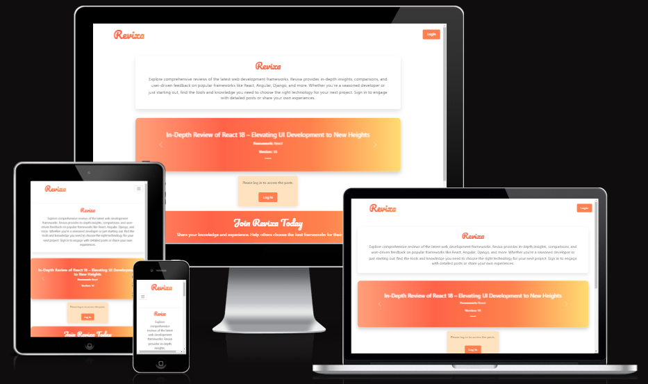
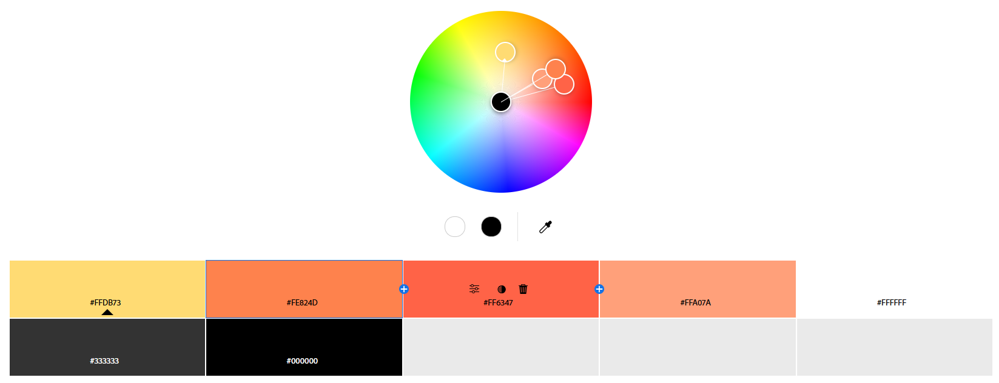

# Revixa
Developer: Mario Borges

[View live website](https://revixa-frontend-d26a64f75023.herokuapp.com/)

## Table of Contents
1. [About](#about)
2. [Project Goals](#project-goals)
3. [User Experience](#user-experience)
    1. [Target Audience](#target-audience)
    2. [User Requirements and Expectations](#user-requirements-and-expectations)
    3. [User Stories](#user-stories)
4. [Technical Design](#technical-design)
    1. [Agile Design](#agile-design)
    2. [CRUD Functionality](#crud-functionality)
    3. [Colours](#colours)
    4. [Fonts](#fonts)
    5. [Wireframes](#wireframes)
5. [Technologies Used](#technologies-used)
6. [Front-End](#front-end)
7. [Back-End API](#back-end-api)
8. [Features](#features)
9. [Future Features / Improvements](#future-features--improvements)
10. [Validation](#validation)
11. [Testing](#testing)
12. [Bugs](#bugs)
13. [Deployment](#deployment)
14. [Credits](#credits)
15. [Acknowledgements](#acknowledgements)

## About

Revixa is a web app for discovering and sharing reviews of popular web development frameworks. It provides insights, comparisons, and user feedback on frameworks. Users can sign in to read in-depth posts, leave feedback, or share their own experiences.

## Project Goals

Revixa aims to build a community platform where developers can share and access valuable insights on web development frameworks. Key features include user registration, authentication, and CRUD functionality for reviews, comments and profiles.

Key functionality aspects:
- Simple, intuitive user interface
- User authentication
- Full CRUD (Create, Read, Update, Delete) for user accounts, comments, and reviews created by Admins
- Responsive design to ensure a smooth experience on mobile and desktop devices

## User Experience

### Target Audience

- Web developers and software engineers looking for insights on different web development frameworks.
- New developers seeking guidance on choosing the right technology for their projects.
- Experienced developers who want to share their knowledge, reviews, and experiences with specific frameworks.
- Tech enthusiasts interested in keeping up with the latest trends and tools in web development.

### User Requirements and Expectations

- An intuitive, easy-to-navigate interface that simplifies the process of browsing and contributing reviews.
- Clear and consistent responses for actions like registration, login, and posting reviews by Admins or comments.
- Visual feedback for actions such as submitting a review, leaving a comment, or updating a profile.
- Accessibility features to ensure inclusivity for users with various needs.
- Responsive design for an optimal experience on both mobile and desktop devices.
- Secure authentication and profile management to protect user data and enhance trust.

### User Stories

1. As a new user, I can register on Revixa to create an account and access the platform's features.
2. As a user, I can log in to access my profile and personalized content.
3. As a user, I can update my password to enhance security by providing my current and new password.
4. As a user, I can update my email to keep my contact information up-to-date.
5. As a user, I can use the navigation bar to access different sections (Login/Logout and User Area).
6. As a user, I can view the home page to understand Revixa's purpose and access login or registration options.
7. As a user, I can find reviews that match my interests.
8. As a user, I can comment on reviews to engage in discussions or share feedback.
9. As a user, I can like or unlike comments from other users to support helpful content.
10. As a user, I can see feedback when I have a successful or unsuccessful action.
11. As a user, I can access social media links in the footer to connect with Revixa externally.

### Admin Stories (Backend Only)

12. As an admin, I can create reviews to provide expert insights on specific frameworks.
13. As an admin, I can edit or delete reviews to manage the content on the platform.

### Site Owner Stories

14. As the site owner, I want to restrict features to logged-in users to maintain privacy.
15. As the site owner, I want the site to be fully responsive for a smooth experience on all devices.
16. As the site owner, I want a 404 error page for easy navigation if users encounter broken links.
17. As the site owner, I want the user to have a confirmation prompt when an important action is performed.

## Technical Design

### Agile Design

An agile approach was taken in developing this project, utilizing GitHub Projects to track User Stories and prioritize essential functionalities. Labels were used to categorize and guide development focus.

This agile methodology enabled the timely delivery of core functionalities for Revixa, with flexibility for future enhancements.

### CRUD Functionality

Revixa offers full CRUD functionality for user account management:

- **Create**: Users can register and create accounts, post comments on reviews, and give likes to comments. Admins can create new reviews.
- **Read**: Users can view their profile information, browse reviews, read comments, and see which comments they or others have liked.
- **Update**: Users can update their profile details, change their email and password, edit their comments, and toggle likes on other users’ comments. Admins can edit reviews as necessary.
- **Delete**: Users can remove their comments and unlike previously liked comments. Admins have the ability to delete reviews to maintain platform quality.

### Colours

The Revixa color palette includes shades of orange and white, providing a modern and pleasant visual experience.

Colours

### Fonts

The font Pacifico was used to ensure a clean and modern reading experience.

### Wireframes

Wireframes of the pages were created to guide the visual development of the project.

Login

Register

Home Not Login

Home Logged in

Dashboard

Post

Account Settings

Page 404

## Technologies Used

### Coding Languages

- HTML
- CSS
- JavaScript

### Frameworks and Tools

- [React](https://reactjs.org/) - Framework for building user interfaces
- [Bootstrap](https://getbootstrap.com/) - CSS framework for components and responsiveness
- [GitHub Projects](https://github.com/) - Used for agile project management and version control

### Libraries

- [Axios](https://axios-http.com/) - For making HTTP requests to interact with the backend API
- [Bootstrap](https://getbootstrap.com/) - CSS framework for responsive design and component styling
- [React-Bootstrap](https://react-bootstrap.github.io/) - Pre-built Bootstrap components for React
- [JWT Decode](https://www.npmjs.com/package/jwt-decode) - For decoding JSON Web Tokens, used in handling authentication
- [React Router DOM](https://reactrouter.com/) - For managing navigation and routing within the app
- [React Toastify](https://fkhadra.github.io/react-toastify/) - Provides elegant notifications for user interactions
- [Styled Components](https://styled-components.com/) - For styling components with CSS-in-JS

### Dev Libraries

- [Vite](https://vitejs.dev/) - Fast build tool and development server, integrated with React for an optimized workflow
- [ESLint](https://eslint.org/) - For code linting and maintaining code quality
- [ESLint Plugin React](https://www.npmjs.com/package/eslint-plugin-react) - Extends ESLint with React-specific rules
- [ESLint Plugin React Hooks](https://www.npmjs.com/package/eslint-plugin-react-hooks) - Enforces React Hooks rules within ESLint
- [Styled Components](https://styled-components.com/) - For component-level styling with CSS-in-JS in a React environment
- [React Types](https://www.npmjs.com/package/@types/react) and [React DOM Types](https://www.npmjs.com/package/@types/react-dom) - TypeScript types for React and React DOM, useful for TypeScript projects

## Front-End

The front-end was built with React and Vite for optimized development. Modular components ensure efficiency, with React Bootstrap for styling and Styled Components for custom designs.

### Components and Their Use

#### `<Navbar />`
Provides primary navigation functionality for the site, allowing users to access different sections, including login, logout, and user areas.
**Used in User Stories:** 5

#### `<Footer />`
Contains social media links and additional site information.
**Used in User Stories:** 11

#### `<RegisterCTA />`
Prompts new users to register and directs them to the appropriate form.
**Used in User Stories:** 1, 6

#### `<PrimaryButton />`
A reusable component for consistent button styling across the application.

#### `<Post />`
Represents individual review posts, displaying content and interacting with user comments and likes.
**Used in User Stories:** 7, 8, 9

#### `<LikeButton />`
Allows users to like or unlike comments from other users.
**Used in User Stories:** 9

#### `<ReviewContent />`
Handles the display of detailed review content.
**Used in User Stories:** 7, 8

#### `<GlobalStyles />`
Manages global styling for consistent appearance across the application.

### Context

#### `AuthContext`
Manages user authentication state, providing context for login, registration, and logout functionalities.
**Used in User Stories:** 1, 2, 3, 14

### Pages

#### **Home Page** (`Home`)
Provides a landing page with information about Revixa, including calls to action for login or registration.
**Used in User Stories:** 6

#### **Register Page** (`Register`)
Allows new users to create accounts by providing their information.
**Used in User Stories:** 1

#### **Login Page** (`Login`)
Handles user login functionality, including form validation and error handling.
**Used in User Stories:** 2

#### **Dashboard Page** (`Dashboard`)
Provides personalized content for logged-in users, including profile and account settings access.
**Used in User Stories:** 2, 5

#### **AccountSettings Page** (`AccountSettings`)
Allows users to update their email, password, and other profile information.
**Used in User Stories:** 3, 4, 5, 12

#### **Page404** (`Page404`)
Displays a 404 error page for navigating users when encountering broken links.
**Used in User Stories:** 16

#### **Reviews Page** (`Reviews`)
Displays a list of reviews and individual review posts.
**Used in User Stories:** 7, 8

#### **ReviewPosts** (`ReviewPosts`)
Displays individual review details, including comments and likes.
**Used in User Stories:** 7, 8, 9

### Services

#### `api.js`
Serves as a base configuration for making HTTP requests to the backend API. It handles API initialization, common request settings, and error handling.
**Used in User Stories:** All relevant user interactions requiring data fetch or submission (e.g., 1, 2, 3, 4, 5, 7, 8, 9, etc.)

#### `auth.js`
Manages all authentication-related operations, including user login, registration, and token management.
**Used in User Stories:** 1, 2, 3, 14

#### `like.js`
Handles actions related to liking or unliking comments or reviews, providing methods for toggling the like status.
**Used in User Stories:** 9 (likes and unlikes on comments)

#### `posts.js`
Manages CRUD operations for posts, including fetching posts, creating new posts, updating existing ones, and deleting.
**Used in User Stories:** 7, 12, 13 (for admin actions)

#### `reviews.js`
Provides functions to handle operations specifically related to reviews, including fetching review details and other review-related tasks.
**Used in User Stories:** 7, 8, 12, 13 (admin tasks for reviews)

#### `user.js`
Handles user-related functions such as fetching user data, updating user information, and managing user profiles.
**Used in User Stories:** 4, 5 (profile and account management operations)

## Back-End API

The back-end API for Revixa’s front-end was built with the Django REST Framework, offering full support for account and profile management.
[here](https://github.com/MarioLFB/Revixa-backend)

## Features

- **Authentication**: Users can register, log in, and log out to securely access their accounts.
- Covered in user stories: 1, 2, 14

Register

Login

Log out

- **Profile Management**: Users can update their profile information, change their email and password.
- Covered in user stories: 3, 4

Account Settings

- **Review Access**: The Dashboard provides a streamlined overview of all available reviews, enabling users to quickly access detailed.
- Covered in user stories: 7, 12, 13

Dashboard

- **Commenting and Likes**: Users can engage with reviews by posting comments,as well as editing and deleting them, liking other users' comments, and removing likes if desired.
- Covered in user stories: 8, 9

Posts

- **Navigation**: A navigation bar, along with intuitive links, allows users to effortlessly explore different sections and areas of the site.
- Covered in user stories: 5, 6

Links and Navigation

- **Responsive Design**: Optimized for a smooth experience on various devices and desktop.
- Covered in user stories: 15

Responsive

- **Footer**: Provides social media links, contact information, and copyright details for easy access.
- Covered in user stories: 11

Footer

- **User Feedback**: Provides feedback on user actions, indicating success or failure, and includes prompts to confirm important actions.
- Covered in user stories: 10, 17

Feedback

- **404 Error Page**: A custom 404 error page helps users navigate back to active areas of the site when encountering broken or nonexistent links.
- Covered in user stories: 16

404 Page

## Future Features / Improvements

- **Password Recovery**: Allow users to recover their accounts by receiving a password reset link via email.
- **Social Authentication**: Enable users to log in with social media accounts like Google or LinkedIn.
- **Notifications**: Introduce notifications to keep users updated on relevant activity and engagement.
- **Enhanced Admin Tools**: Expand admin capabilities to improve monitoring and moderation of user-generated content.

## Validation

### HTML Validation

The W3C HTML Validator was used to validate the website’s HTML, with no errors detected.

Home

Login

Register

Dashboard

Posts

Account Settings

Page 404

### CSS Validation

The W3C CSS Validator was used to validate the website’s CSS, with all files passing validation.

Account Settings

Footer

Global Styles

Home

Like Button

Login

Navbar

Page 404

Post

Primary Button

Register

Register CTA

Review Content

Review Posts

Review

### JavaScript Validation

Project was successfully validated using ESLint, confirming adherence to defined coding standards and ensuring consistency across JavaScript and JSX code.

Lint

### Lighthouse and Accessibility Validation

#### Lighthouse:

Home Desktop

Home Mobile

Login Desktop

Login Mobile

Register Desktop

Register Mobile

Dashboard Desktop

Dashboard Mobile

Posts Desktop

Posts Mobile

Account Settings Desktop

Account Settings Mobile

Page 404 Desktop

Page 404 Mobile

#### Wave Validation:

Home

Login

Register

Dashboard

Posts

Account Settings

Page 404

## Testing

### Device Testing

The website was tested on various devices:
- Windows PC
- MacBook Pro
- iPhone and Android mobile devices

### Browser Compatibility

The website was tested on the following browsers:
- Google Chrome
- Mozilla Firefox
- Safari

### Manual Testing

A detailed manual testing process was conducted to validate the functionality of each user story. See [Testing User Stories](#testing) for more information.

1. As a new user, I can register on Revixa to create an account and access the platform's features.

| Feature           | Action                                                        | Expected Result                                                                                  | Actual Result        |
| ----------------- | ------------------------------------------------------------ | ------------------------------------------------------------------------------------------------ | -------------------- |
| Authentication    | Navigate to the registration page, fill in the required fields, and submit the form | Account should be created, and user redirected to a confirmation or login page upon successful registration | Works as expected    |

Register

2. As a user, I can log in to access my profile and personalized content.

| Feature           | Action                                                        | Expected Result                                                                                  | Actual Result        |
| ----------------- | ------------------------------------------------------------ | ------------------------------------------------------------------------------------------------ | -------------------- |
| Authentication    | Navigate to the login page, fill in username and password, and submit | User should be authenticated and redirected to their profile or personalized dashboard            | Works as expected    |

Login

3. As a user, I can update my password to enhance security by providing my current and new password.

| Feature           | Action                                                        | Expected Result                                                                                  | Actual Result        |
| ----------------- | ------------------------------------------------------------ | ------------------------------------------------------------------------------------------------ | -------------------- |
| Profile Management | Navigate to account settings, enter current password, new password, and confirm new password, then submit | User's password should be updated with a success confirmation                                   | Works as expected    |

Profile Management

4. As a user, I can update my email to keep my contact information up-to-date.

| Feature           | Action                                                        | Expected Result                                                                                  | Actual Result        |
| ----------------- | ------------------------------------------------------------ | ------------------------------------------------------------------------------------------------ | -------------------- |
| Profile Management | Navigate to account settings, change the email address field, and submit | User's email should be updated with a success message                                           | Works as expected    |

Profile Management

5. As a user, I can use the navigation bar to access different sections (Login/Logout and User Area).

| Feature           | Action                                                        | Expected Result                                                                                  | Actual Result        |
| ----------------- | ------------------------------------------------------------ | ------------------------------------------------------------------------------------------------ | -------------------- |
| Navigation        | Use the navigation bar links to access different site sections | User should be able to seamlessly navigate between sections                                      | Works as expected    |

Navigation

6. As a user, I can view the home page to understand Revixa's purpose and access login or registration options.

| Feature           | Action                                                        | Expected Result                                                                                  | Actual Result        |
| ----------------- | ------------------------------------------------------------ | ------------------------------------------------------------------------------------------------ | -------------------- |
| Home Page         | Visit the homepage                                           | User should see site description and links to login or register                                  | Works as expected    |

Home Page

7. As a user, I can find reviews that match my interests.

| Feature           | Action                                                        | Expected Result                                                                                  | Actual Result        |
| ----------------- | ------------------------------------------------------------ | ------------------------------------------------------------------------------------------------ | -------------------- |
| Review Access     | Use search or filters to find reviews                        | User should see a list of relevant reviews matching their interests                              | Works as expected    |

Review Access 

8. As a user, I can comment on reviews to engage in discussions or share feedback.

| Feature           | Action                                                        | Expected Result                                                                                  | Actual Result        |
| ----------------- | ------------------------------------------------------------ | ------------------------------------------------------------------------------------------------ | -------------------- |
| Commenting and Likes | Add a comment to a review and submit                      | Comment should be posted and displayed under the review                                         | Works as expected    |

Commenting and Likes

9. As a user, I can like or unlike comments from other users to support helpful content.

| Feature           | Action                                                        | Expected Result                                                                                  | Actual Result        |
| ----------------- | ------------------------------------------------------------ | ------------------------------------------------------------------------------------------------ | -------------------- |
| Commenting and Likes | Click like/unlike on comments                              | Like/unlike status should toggle for the comment                                                | Works as expected    |

Commenting and Likes

10. As a user, I can see feedback when I have a successful or unsuccessful action.

| Feature           | Action                                                        | Expected Result                                                                                  | Actual Result        |
| ----------------- | ------------------------------------------------------------ | ------------------------------------------------------------------------------------------------ | -------------------- |
| User Feedback     | Perform actions like login, registration, form submission, etc. | User should see visual feedback indicating success or error                                     | Works as expected    |

User Feedback 

11. As a user, I can access social media links in the footer to connect with Revixa externally.

| Feature           | Action                                                        | Expected Result                                                                                  | Actual Result        |
| ----------------- | ------------------------------------------------------------ | ------------------------------------------------------------------------------------------------ | -------------------- |
| Footer            | Click on social media links in the footer                     | User should be redirected to Revixa's social media pages                                        | Works as expected    |

Footer

#### Testing User Stories - Admin

12. As an admin, I can create reviews to provide expert insights on specific frameworks.
(This tool is linked to the project's backend through the following link: https://revixa-2c64c0effe9d.herokuapp.com/)

| Feature           | Action                                                        | Expected Result                                                                                  | Actual Result        |
| ----------------- | ------------------------------------------------------------ | ------------------------------------------------------------------------------------------------ | -------------------- |
| Review Access     | Navigate to admin review creation page, fill in details, and submit | New review should be created and available for users to view                                   | Works as expected    |

Review Access

13. As an admin, I can edit or delete reviews to manage the content on the platform.
(This tool is linked to the project's backend through the following link: https://revixa-2c64c0effe9d.herokuapp.com/)

| Feature           | Action                                                        | Expected Result                                                                                  | Actual Result        |
| ----------------- | ------------------------------------------------------------ | ------------------------------------------------------------------------------------------------ | -------------------- |
| Review Access     | Navigate to a review and select edit or delete                | Review should be edited or deleted as specified                                                 | Works as expected    |

Review Access

#### Testing User Stories - Site Owner

14. As the site owner, I want to restrict features to logged-in users to maintain privacy.

| Feature           | Action                                                        | Expected Result                                                                                  | Actual Result        |
| ----------------- | ------------------------------------------------------------ | ------------------------------------------------------------------------------------------------ | -------------------- |
| Authentication    | Attempt to access restricted features without logging in     | User should be redirected to login page or see an access denied message                          | Works as expected    |

Authentication

15. As the site owner, I want the site to be fully responsive for a smooth experience on all devices.

| Feature           | Action                                                        | Expected Result                                                                                  | Actual Result        |
| ----------------- | ------------------------------------------------------------ | ------------------------------------------------------------------------------------------------ | -------------------- |
| Responsive Design | Access site on different devices (mobile, tablet, desktop)   | Site should display and function correctly on all screen sizes                                   | Works as expected    |

Responsive Design

16. As the site owner, I want a 404 error page for easy navigation if users encounter broken links.

| Feature           | Action                                                        | Expected Result                                                                                  | Actual Result        |
| ----------------- | ------------------------------------------------------------ | ------------------------------------------------------------------------------------------------ | -------------------- |
| 404 Error Page    | Navigate to a nonexistent URL                                 | User should see a custom 404 error page with navigation options                                  | Works as expected    |

404 Error Page

17. As the site owner, I want the user to have a confirmation prompt when an important action is performed.

| Feature           | Action                                                        | Expected Result                                                                                  | Actual Result        |
| ----------------- | ------------------------------------------------------------ | ------------------------------------------------------------------------------------------------ | -------------------- |
| User Feedback     | Perform an important action like deleting a comment or updating profile | User should see a confirmation prompt before action is executed                                  | Works as expected    |

User Feedback 

## Bugs

| Bug | Fix |
| --- | --- |
| Users able to like their own posts | Restricted users from liking their own posts by conditionally rendering `LikeButton` only for non-authored posts, using `AuthContext` to verify if the current user is the author. Ensures interaction accuracy by disabling self-likes. (Commit: 8294e67b32125b7ae34d9a547d05a1a33285b1a6) |
| Misaligned LikeButton and LikesCount in Post component | Fixed by grouping `LikeButton` and `LikesCount` within `LikeContainer`, improving alignment and spacing. (Commit: 8f55be899d7adb4bbb8a6cb4858f071f1cc0750b) |
| Incorrect navigation behavior of PrimaryButton | Fixed `PrimaryButton` to correctly use `react-router` `Link` for proper navigation behavior. (Commit: 7e79de89f12760a3da4ed935189998f89de285c8) |
| Liking posts with incorrect HTTP method | Changed `likePost` method from `GET` to `POST` for liking posts. (Commit: 2e7502ad2460cfa8450ad112df0038a240ddab40) |

## Deployment

### Heroku

This project was deployed to Heroku to enable continuous responsive testing. The deployment steps were as follows:
1. Create a Heroku app.
2. Set up required environment variables in Heroku.
3. Deploy via GitHub integration.

### Forking the GitHub Repository

To fork the GitHub repository:
1. Navigate to the [GitHub repository](https://github.com/MarioLFB/Revixa-frontend.git).
2. Click on "Fork" in the upper-right corner to create a copy on your account.

### Cloning the GitHub Repository

To clone the GitHub repository:
1. Navigate to the repository.
2. Click on "Code" and copy the repository URL.
3. Run `git clone <URL>` in your terminal.

## Credits

### Tutorials

- [Django Documentation](https://docs.djangoproject.com/)
- [React Documentation](https://reactjs.org/docs/getting-started.html)

### Code

- Code Institute's Moments project was referenced for user authentication logic.

## Acknowledgements

- My mentor for guidance throughout the project.

[Back to Top](#revixa)